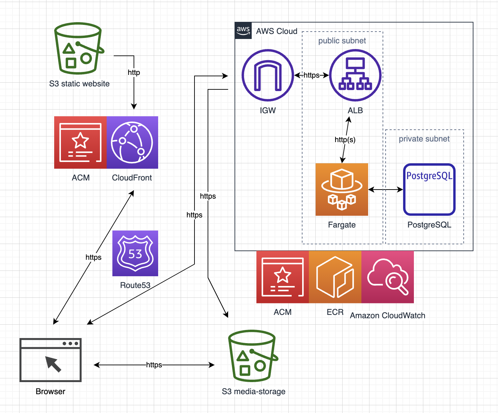

# 無劣化転送
画像を気軽にアップロード、ダウンロードできます。
https://harukifreedomein.tk/
# 使用技術
- FastAPI/Python
- alembic
- React.js
- AWS/S3/FARGATE/RDS/ALB/Route53/CloudFront・・・・
- Docker
- html/css/javascript
- flake8,black,isort
# インフラ構成図

- フロント(サイトの表示)はS3の静的ウェブサイトホスティングをCloudFront+Route53でカスタムドメイン付きのhttps通信
- サーバーサイドはpublic subnetにfargate、private subnetにPostgreSQL、fargateの前にACMの証明書をいれたALBを配置しhttps通信
- ストレージはS3
- 開発時はpytestを実行し、linter、formatterも利用
# 機能一覧
- 画像のアップロード、ダウンロード
- 選択・取得画像の拡大表示、削除、保存
- 画像をまとめて保存
- buttonを押してurlコピー

# フロントのコード
https://github.com/hapchoke/front-murekka